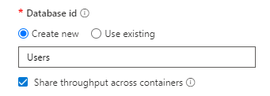
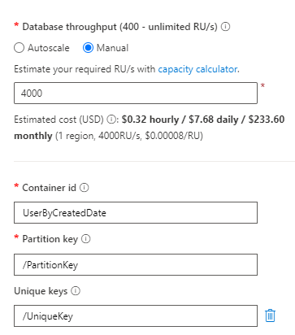
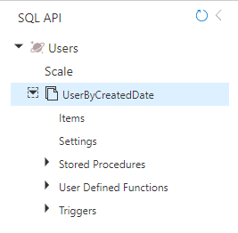
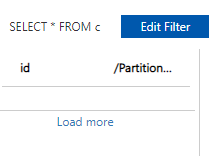

# Cosmos Db Clean Architecture with Azure Functions

This example shows how to implement a clean architecture of azure functions with Cosmos Db. 


## Features

- Read and write Azure Function APIs.
- Cached repository pattern.
- Generic search APIs.
- Upload with duplicacy check.


## Installation

Install my-project with npm

```sh
$ git clone https://github.com/rahulkapoor007/Cosmos-Clean-Architecture.git
$ cd CosmosCleanArchitecture.FunctionApp
$ dotnet restore
$ dotnet run
```
Download cosmos db emulator from the following url for local debugging :
``
https://aka.ms/cosmosdb-emulator
``

After downloading, install cosmos db emulator.

After Installation this window will appear.


This contain the CosmosEndpoint and CosmosMasterKey for local debugging.

After this perform the following steps:
- Create a database with database Id : ``Users``

- Create a container with container Id : ``UsersByCreatedDate``
- Create a container with container Id : ``UsersByCreatedDate``
- Add partition key name as : ``\partitionKey``
- Add unique key as : ``\uniqueKey``


Currently uniqueness of a record is based on the email field and if any record with duplicate email is inserted into cosmos db it will give an conflict error with status code : ``409``. You can add or remove any field by modifying the class:
```
    public class UserIdentifiers
    {
        public string Email { get; set; }
    }
```
- After the database and container are created it will be visible inside the explorer like this :

and currently it will have zero records.

## How to test
There are 2 Http Azure Functions that you can test:

 - `POST:` `http://localhost:7071/api/SaveDataToCosmos`: upload the users data in JSON format;
 - `GET/POST:` `http://localhost:7071/api/GetUserList`: get users data according to various filters with pagination;

 #### Testing first API ``SaveDataToCosmos``

- Add this as request body:
```
[
    {
        "firstName":"Arjit",
        "lastName":"Singh",
        "email":"arjitsingh@gmail.com",
        "gender":"Male",
        "ipAddress":"232.40.22.203"
    },
    {
        "firstName":"Hadik",
        "lastName":"Pandya",
        "email":"hardikpandya@gmail.com",
        "gender":"Male",
        "ipAddress":"63.32.57.193"
    },
]
```
- There is a JSON file `MOCK_DATA.json` containing dummy records for testing the API.
- Respose of the API: 
`` 2 Records inserted into cosmos with Id : fd4b92b8-1e33-42d5-a175-f23d1ac2e2a6``

#### Testing second API ``GetUserList``

- Add this as request body:

```
{
    "userByCreatedDate":"2022-06-16",
    "generalSearchField" : "",
    "searchField":[
        {
            "fieldName":"firstName",
            "fieldValue":[
                "ar"
            ],
            "operatorType":3
        }
    ],
    "sortingField":{
        "fieldName":"firstName",
        "direction":"ASC"
    },
    "pageNumber":9,
    "pageSize":10

}
```

Explanation of the response body is:
- `UserByCreatedDate` is the partition key which is mandatory for searching.
- `generalSearchField` is the value which need to be search in all documents.
- `searchField` contain the values of particular column that need be searched. This field can contain multiple values that need to be searched for multiple columns.
- `fieldName` is the actual name of the column from response that need to be searched.
- `fieldValue` is the value need to be searched.
- `operatorType` contain the integer value for the type of operator need to be applied on fieldValue of that fieldName.
```
OperatorType | OperatorValue
    EQ              1
    IN              2
    LIKE            3
    GT              4
    LT              5
    GTE             6
    LTE             7
```

- `sortingField.fieldName` contain sorting column name.
- `sortingField.direction` contain the sorting direction i.e ASC or DESC.
- `pageNumber` is the page number that need in the response.
- `pageSize` is the page size that need in the response.

- Respose of the API: 
````
{
    "userList":[
        {
            "firstName":"Arjit",
            "lastName":"Singh",
            "email":"arjitsingh@gmail.com",
            "gender":"Male",
            "ipAddress":"232.40.22.203"
        }
    ],
    "totalCount":91,
    "pageIndex":9,
    "pageSize":10,
    "resultCount":1
}
````


## Contributing

Contributions are always welcome!

This example was created with the intent of helping people who have doubts on how to implement clean architecture for cosmos db using azure functions.

If you have doubts about the implementation details or if you find a bug, please, open an issue. If you have ideas on how to improve the API or if you want to add a new functionality or fix a bug, please, send a pull request.

